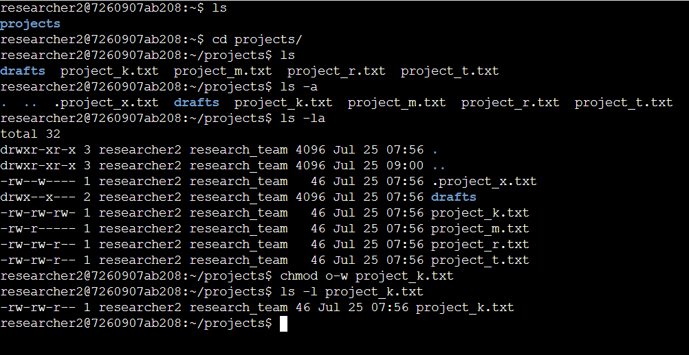
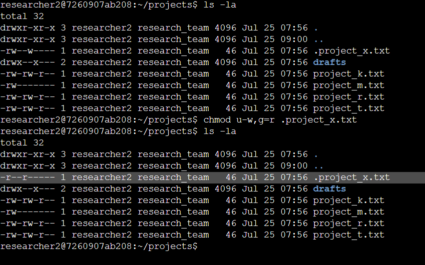
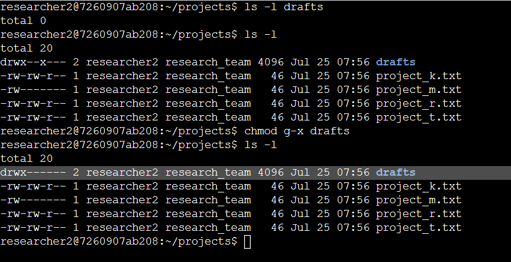

# Managing Linux File Permissions

  In this project I will demonstrate my experience using Linux commands to examine and manage file permissions.

## Check file and directory details

  In this task, I explore the permissions of the projects directory and the files it contains. The lab starts with /home/researcher2 as the current working directory. This is because I'm changing permissions for files and directories belonging to the researcher2 user.

  I used the commands <code>ls</code> to list the files in the current directory and <code>-l</code> to list the permissions of the files. <code>-a</code>   shows hidden files, so I ran <code>ls -la</code> to list all the files within the current working directory and their permissions, incliding the hidden ones

## Describe the permissions string

In Linux, permissions are represented with a 10-character string: <code>drwxrwxrwx</code>  
  - <b>read:</b> for files, this is the ability to read the file contents; for directories, this is the ability to read all contents in the directory including both files and subdirectories

- <b>write:</b> for files, this is the ability to make modifications on the file contents; for directories, this is the ability to create new files in the directory

- <b>execute:</b> for files, this is the ability to execute the file if it’s a program; for directories, this is the ability to enter the directory and access its files

These permissions are given to these types of owners:

- <b>user(u):</b> the owner of the file

- <b>group(g):</b> a larger group that the owner is a part of

- <b>other(o):</b> all other users on the system

The 1st character indicates the file type. The <code>d</code> indicates it’s a directory. When this character is a hyphen (<code>-</code>), it's a regular file.

The 2nd-4th characters indicate the read (<code>r</code>), write (<code>w</code>), and execute (<code>x</code>) permissions for the <b>user</b>. When one of these characters is a hyphen (<code>-</code>) instead, it indicates that this permission is not granted to the user. 

The 5th-7th characters indicate the read (<code>r</code>), write (<code>w</code>), and execute (<code>x</code>) permissions for the group. When one of these characters is a hyphen (<code>-</code>) instead, it indicates that this permission is not granted for the group.

The 8th-10th characters indicate the read (<code>r</code>), write (<code>w</code>), and execute (<code>x</code>) permissions for the owner type of other. This owner type consists of all other users on the system apart from the user and the group. When one of these characters is a hyphen (<code>-</code>) instead, that indicates that this permission is not granted for other.

## Change file permissions
In this example, I will change the permissions for any files that have write permissions for owner of types other.

To change permissions, <code>chmod</code> command is used, Linux uses mathematical equations to add or remove permissions, in this case I will use <code>o-w</code> followed by the file or directory you want to change permissions for, in this example is project_k.txt. 
<code>chmod o-w project_k.txt</code>

## Change file permissions on a hidden file

The file .project_x.txt is a hidden file that has been archived and should not be written to by anyone. The user and group should still be able to read this file. As seen in previous examples, user and group have write permissions for .project_x.txt.

So I will change the permissions to both user an group to read only.

<code>chmod u-w,g=r .project_x.txt</code>

## Change directory permissions

In this task, I must change the permissions of a directory. First, I’ll check the group permissions of the /home/researcher2/projects/drafts directory and then modify the permissions as required.

Only the researcher2 user should be allowed to access the drafts directory and its contents. This means that only researcher2 should have execute privileges.

I have to remove group execute permissions, i will run <code>chmod g-x drafts</code> to remode execute permissions

## Summary

In this project I can demonstrate I have practical experience in using basic Linux Bash shell commands to:
- examine file and directory permissions,
- change permissions on files,
- change permissions on directories, and
- examine and change permissions on hidden files and directories.
This is an important milestone on my journey toward managing authorization in Linux!

## 
