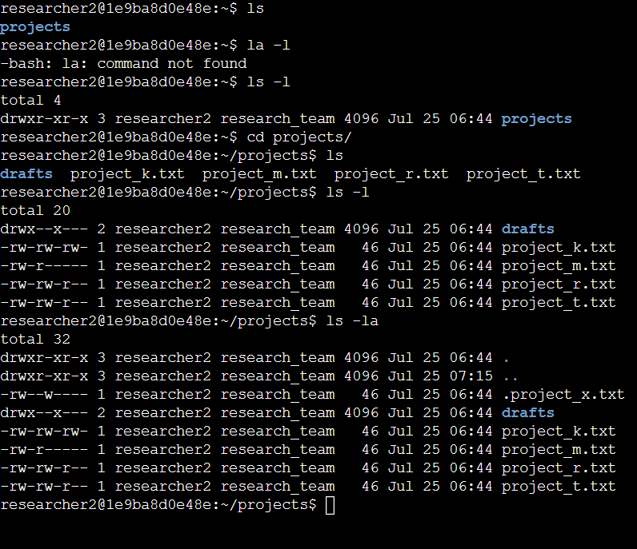

# Managing Linux File Permissions
In this project I will demonstrate my experience using Linux commands to examine and manage file permissions.
## Check file and directory details
In this task, I explore the permissions of the projects directory and the files it contains. The lab starts with /home/researcher2 as the current working directory. This is because I'm changing permissions for files and directories belonging to the researcher2 user.

I used the commands <code>ls</code> to list the files in the current directory and <code>-l</code> to list the permissions of the files. <code>-a</code> shows hidden files, so I ran <code>ls -la</code> to list all the files within the current working directory and their permissions, incliding the hidden ones

## Describe the permissions string
In Linux, permissions are represented with a 10-character string: <code>drwxrwxrwx</code>  
- <b>read:</b> for files, this is the ability to read the file contents; for directories, this is the ability to read all contents in the directory including both files and subdirectories

- write: for files, this is the ability to make modifications on the file contents; for directories, this is the ability to create new files in the directory

- execute: for files, this is the ability to execute the file if it’s a program; for directories, this is the ability to enter the directory and access its files

The 1st character indicates the file type. The <code>d</code> indicates it’s a directory. When this character is a hyphen (<code>-</code>), it's a regular file.

The 2nd-4th characters indicate the read (<code>r</code>), write (<code>w</code>), and execute (<code>x</code>) permissions for the <b>user</b>. When one of these characters is a hyphen (<code>-</code>) instead, it indicates that this permission is not granted to the user. 

The 5th-7th characters indicate the read (<code>r</code>), write (<code>w</code>), and execute (<code>x</code>) permissions for the group. When one of these characters is a hyphen (<code>-</code>) instead, it indicates that this permission is not granted for the group.

The 8th-10th characters indicate the read (<code>r</code>), write (<code>w</code>), and execute (<code>x</code>) permissions for the owner type of other. This owner type consists of all other users on the system apart from the user and the group. When one of these characters is a hyphen (<code>-</code>) instead, that indicates that this permission is not granted for other.

## Change file permissions

## Change file permissions on a hidden file

## Change directory permissions

## Summary

## 
